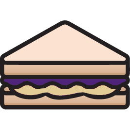

<!-- AUTO-GENERATED-CONTENT:START (STARTER) -->
<p align="center">
  <a href="https://www.gatsbyjs.com">
    
  </a>
</p>
<h1 align="center">
  Peanut Butter & Jelly Template
</h1>

This template was created using Gatsby's default starter for more general information about this starter go here: <a href="https://github.com/gatsbyjs/gatsby-starter-default">Gatsby starter default</a>

This documentation assumes that you understand how to navigate a project and execute commands from the command line.

## 🚀 Quick start

1.  **Install Packages**

    This template uses yarn but npm should work as well. However some minimal configuration may be needed so I recommend sticking with Yarn.
    ```
    yarn
    ```

2.  **Start Developing**

     This starts Gatsby on your local network on port 8000. You can use either <a href="http://localhost:8000">localhost:8000</a> or your computer's IP address to debug. All the      information required to debug including the IP address will appear in your terminal after the development bundle has finished building the first time.
   
     ```
     yarn develop
     ```
     
# 🧐 What's inside?

##  Free template - Plain

A quick look at what's included in the free template.

    ├── src ─
            ├── components ─ 
                           ├── avatar
                           ├── call-to-action
                           ├── grid
                           ├── header
                           ├── image
                           ├── intersection-observer
                           ├── landing
                           ├── layout
                           ├── seo
            ├── content
            ├── enums
            ├── graphql
            ├── images
            ├── interfaces
            ├── modules
            ├── pages
            ├── services
            ├── utils
    ├── .gitignore
    ├── .prettierrc
    ├── .prettierignore
    ├── codegen.yml
    ├── gatsby-browser.js
    ├── gatsby-config.js
    ├── gatsby-node.js
    ├── gatsby-ssr.js
    ├── LICENSE
    ├── package.json
    ├── README.md
    ├── tsconfig.json
    └── yarn.lock
    
### Key Features

1.  **`landing page`**: What you see is what you get. A fast and customizable landing page with everything you need to get started.

2.  **`Theme support`**: Declare color schemes once and use them everywhere inside the template.

3.  **`Typescript integration`**: Get started with Typescript quickly and with zero configuration required.

##  Paid template - Sliced Bread

A quick look at what's included in the paid template.

<pre>
├── <b><i>__mocks__</i></b>
├── src ─
        ├── components ─ 
                       ├── avatar
                       ├── <b><i>blog</i></b>
                       ├── call-to-action
                       ├── <b><i>convert-modal</i></b>
                       ├── grid
                       ├── header
                       ├── image
                       ├── intersection-observer
                       ├── landing
                       ├── layout
                       ├── seo
        ├── content
        ├── <b><i>contexts</i></b>
        ├── enums
        ├── graphql
        ├── images
        ├── interfaces
        ├── modules
        ├── pages
        ├── services
        ├── <b><i>templates</i></b>
        ├── utils
├── .gitignore
├── .prettierrc
├── .prettierignore
├── codegen.yml
├── gatsby-browser.js
├── gatsby-config.js
├── gatsby-node.js
├── gatsby-ssr.js
├── <b><i>jest-config.js</i></b>
├── <b><i>jest-preprocess.js</i></b>
├── LICENSE
├── <b><i>loadershim.js</i></b>
├── package.json
├── README.md
├── tsconfig.json
└── yarn.lock
</pre>
    
### Key Features

In addition to everything included in the free template you get.

1.  **`Blog page`**: A blog page for showing off your posts.

2.  **`Post template`**: Use this markdown template to turn your markdown posts into easy to read and well formatted blog posts.

3.  **`Conversion popup`**: Convert more site visitors to users / subscribers with a simple but effective popup.

4.  **`Jest testing`**: Test your landing page UI or logic with jest testing integration right out of the box.

5.  **`Future updates`**: As much as I love this template nothing is perfect. Get any new features, fixes, or improvements as they are made.

##   Making changes and refreshing the data layer

In order to change the content of the template you will need to alter the JSON and markdown files located in the src/content folder. Anything related to the landing page can be found in the landing folder and posts will be put in the posts folder (Note: If you are using the free template you will not have a posts folder). 

You may notice that changes you made are not appearing in your browser at times. This can happen when you refresh or when viewing the template on another device using the network debug feature. If this happens your best bet is to stop the development process and restart it. Gatsby will cache the data from queries and will sometimes not get changes to these files. You can make this process a little smoother by including a .env file in the root of the template and adding this variable.
```
ENABLE_GATSBY_REFRESH_ENDPOINT=true
```

And then run this command when you want the data layer to refresh.
```
yarn refresh
```

This should cause Gatsby's developement layer to update with any changes, but when in doubt just restart the development process.


##   Generating types

This template uses graphql codegen to generate Typescript types from the graphql schema. These templates include the output types needed initially. However if you make any changes to the graphql schema or need to add a type you will have to do this yourself.

After making a change to the graphql schema run:
```
yarn generate-types
```

This will generate a new graphQlGenerated.ts file in src/interfaces/data and override the old copy. If you need to add your own types outside of any used in the graphql data layer you should include them in the interfaces folder in a new folder seperate from the data one.

## 🎓 Learning Gatsby

Looking for more guidance? Full documentation for Gatsby lives [on the website](https://www.gatsbyjs.com/). Here are some places to start:

- **For most developers, we recommend starting with our [in-depth tutorial for creating a site with Gatsby](https://www.gatsbyjs.com/tutorial/).** It starts with zero assumptions about your level of ability and walks through every step of the process.

- **To dive straight into code samples, head [to our documentation](https://www.gatsbyjs.com/docs/).** In particular, check out the _Guides_, _API Reference_, and _Advanced Tutorials_ sections in the sidebar.

## 💫 Deploy

[](https://app.netlify.com/start/deploy?repository=https://github.com/gatsbyjs/gatsby-starter-default)

[](https://vercel.com/import/project?template=https://github.com/gatsbyjs/gatsby-starter-default)
